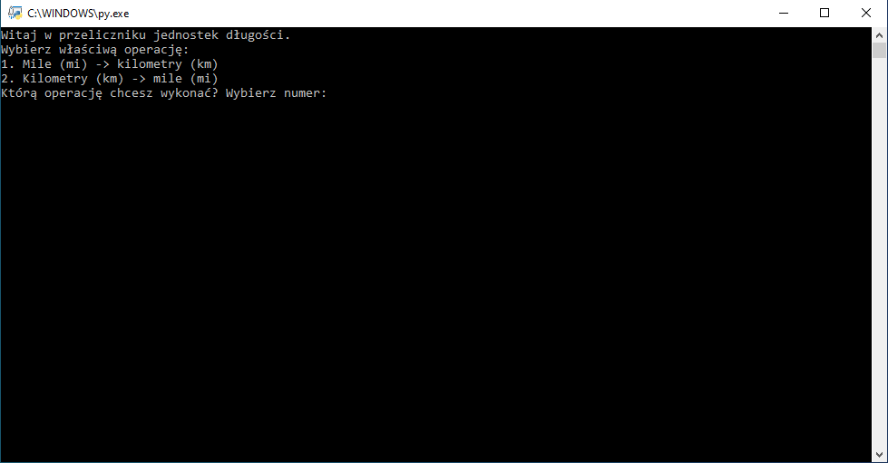

# length-units-converter
Live demo [_here_](https://replit.com/@BartlomiejLis/length-units-converter).

## Tech Stack
- Python

## Screenshots


## Run Locally
Clone the project

```bash
  git clone https://github.com/bartlomiejlis/length-units-converter.git
```

Go to the project directory and run main.py with Python.

The program works in a text form. Follow instructions on your screen to start using it.

## Project Status
Project is: _no longer being worked on_.

## Room for Improvement
- Adding other length units to choose from.

## Authors
Created by Bartłomiej Lis - feel free to contact me at lisu.b117@gmail.com!
